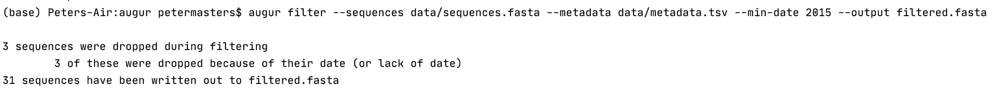
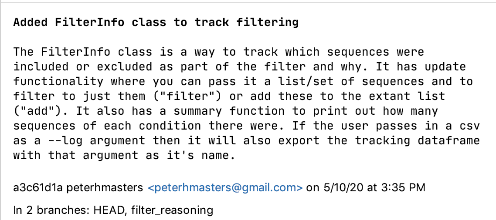

# Peter Masters Final Project, CSCI E-29 Spring 2020
Hello!
I built a class (FilterInfo) to store and display metadata for an open source project 
[Nextstrain](https://nextstrain.org/) from [this issue.](https://github.com/nextstrain/augur/issues/424) 
I chose Nextstrain because I wanted to contribute to an open source project and
Nextstrain seemed interesting, timely, and helpful given the global pandemic. 
Please check out [this slide deck](https://docs.google.com/presentation/d/18GfwaZWHhAImXfmpmCxf2dY9DSKjr8JWCgOlbSnlWMA/edit?usp=sharing) 
where I describe this project in further detail or [watch to the presentation here.](https://drive.google.com/open?id=1Ad99WbjFbn7S-dRll73lP4M81QCmgU9_)
# How to navigate this repo
This repo is broken down into two halves [Testing](Testing) and [NextStrain_Files.](NextStrain_Files)
Testing contains the files I used to initially [build](Testing/TrackFilter.py) and [test](test_filterinfo.py) the class before working on integration into
the Nextstrain codebase. NextStrain_Files contains the built out files,
integration and calls within the [filter.py module,](NextStrain_Files/filter.py) and
my test cases integrated into [theirs.](NextStrain_Files/test_filter.py)

My git history is kind of disparate as the original commits I used to build that class live in this project,
while the git history tracking the integration into the Nextstrain codebase live on a separate pull that I don't have
permission to create a pull request. (YET :) ) I've attached them below.

# How to use FilterInfo
FilterInfo is called using a list/set/str of sequences like so:

`seqs = ["PAN/CDC_259359_V1_V3/2015", "COL/FLR_00024/2015", "PRVABC59"]`

`test = FilterInfo(seqs)`

Most of the time sequences are stored in crazy bioinformatics filetypes like fasta/vcf, an example can be found in [sequences.fasta](Testing/sequences.fasta) .
When FilterInfo() is called, it initializes a dataframe in self and a list of sequences tracking when sequences get filtered or added in.

To update the dataframe and last you call .update(action, reason, new_seq) on the instance of your class, in example:

`test.update("filter", "too short", ["PAN/CDC_259359_V1_V3/2015", "COL/FLR_00024/2015"])`

This functionality mirrors the way that they filtered sequences in the extant code. The action ("filter"/"add") designate if the sequences provided (new_seq)
are the ones to filter down to, or to be added to the current list. Reason is the reason they're being added or filtered and to be stored for
the user to understand later. For instance the above code changes the sequence "PRVABC59" into excluded for being too short in the dataframe, 
while the other two stay as included for passing all filters so far. 

Once all the filtering is over and you want to display summary statistics, you call .summary(filter_reasons)

`test.summary(filter_results_05_11_2020)`

This prints summary statistics at the console level, mirror current implementation and then exports the dataframe to that
destination if provided, or not at all if None.

# How it's implimented
In [NextStrain_Files/filter.py](NextStrain_Files/filter.py) an instance of the class is created once a file is provided:

`filter_info = FilterInfo(all_seq)`

And then updated after every filter step:

`filter_info.update("filter", "excluded for no metadata", tmp)`

And then print/export results:

`filter_info.summary(args.log)`

based on a new cli argument provided by the user:

`parser.add_argument('--log', help="file destination for filter reasoning if it is wanted.")`

# Photos and Links
What the old CLI looks like:

What the new CLI looks like:

What the output csv looks like:

Missing commits:

Links:

[Nextstrain Augur](https://github.com/nextstrain/augur)

[Augur Filter](https://github.com/nextstrain/augur/blob/master/augur/filter.py)

[Augur Filter Documentation](https://nextstrain-augur.readthedocs.io/en/stable/usage/cli/filter.html)
